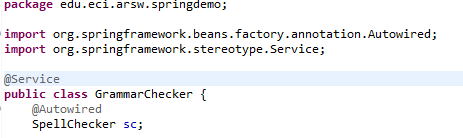
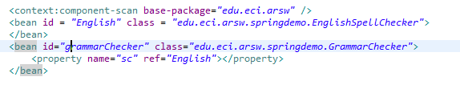
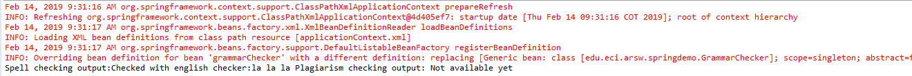
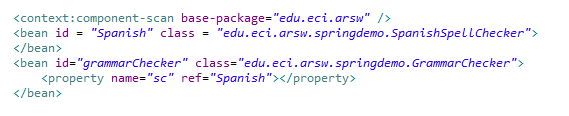
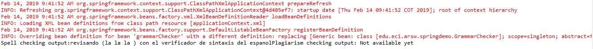

## Part I - Basic workshop 
first of all we need to modify the java file for grammar checker and add the annotations where needed:  
  
  
  
then we need to add the bean tag on the resources files as follows:  
  
  
  
now we test it with the main file and obtain these results:  
  
  
  
finally we change the bean reference to use the spanish checker:  
  
  
  
and finaly we check that the result is correct:  
  
  
  
